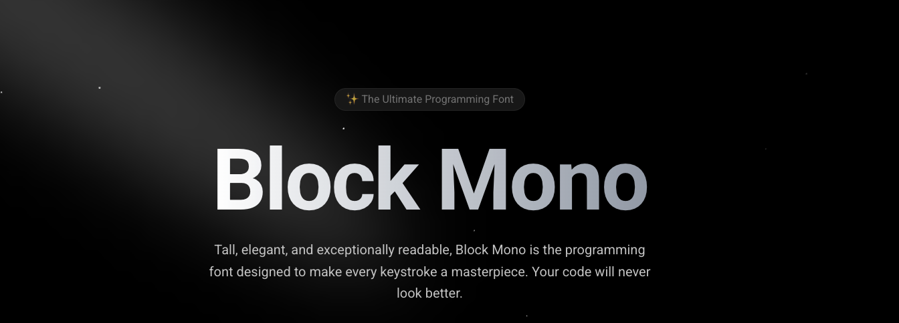
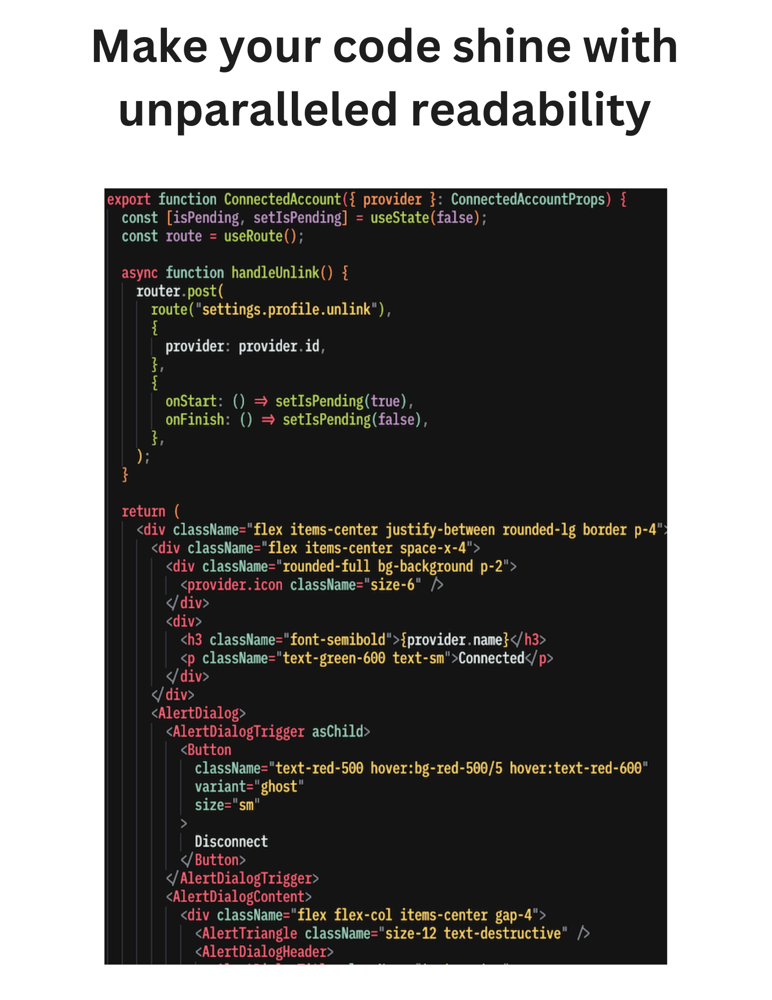
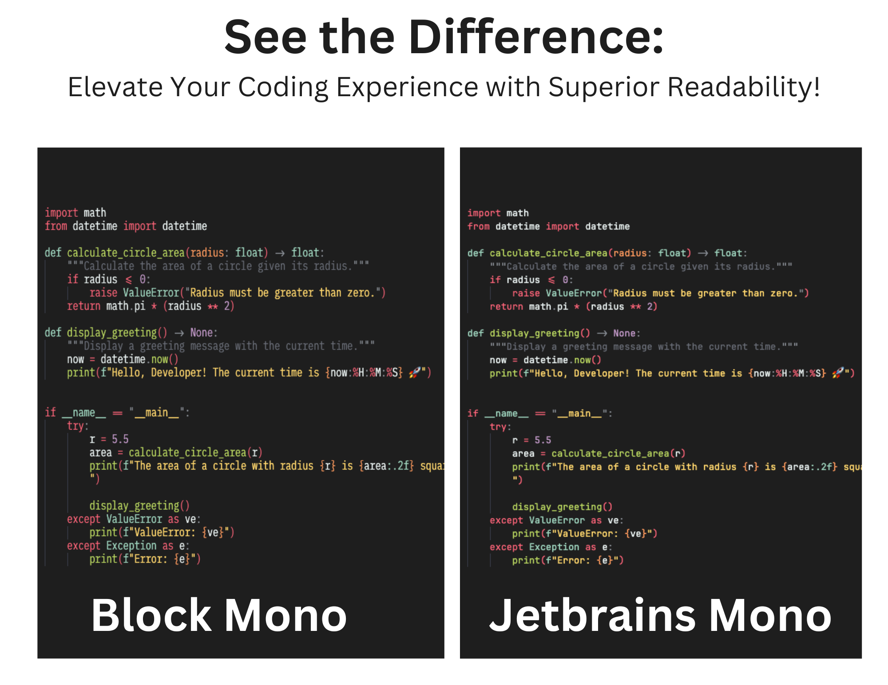

# Block Mono - The Ultimate Programming Font

Block Mono is a meticulously crafted programming font designed to make every keystroke a masterpiece. Tall, elegant, and exceptionally readable, it's the perfect companion for developers who demand both beauty and functionality in their coding environment.

## 🚀 Getting Started

Try Block Mono now and experience the difference in your coding environment. Visit our [website](https://blockmonofont.com) to test the font and see how it can transform your development workspace.

### 📥 Installation

Download the latest version of Block Mono from our [releases page](https://github.com/tyrailleverett/blockmonofont/releases/tag/v1.0.0).

### ✨ Key Features

#### Built for Developers

- Specifically crafted for code editors, terminals, and development environments
- Exceptional readability and clarity in coding contexts

#### Advanced Typography

- Beautiful ligatures for coding symbols
- Variable weights from Thin to Bold
- Enhanced vertical proportions for maximum legibility
- Pixel-perfect rendering on all screen sizes and resolutions

#### Comprehensive Support

- Complete Nerd Font integration with developer icons and symbols
- Multi-language support for various programming languages and character sets
- Optimized for modern development environments

## 🎯 Visual Showcase

Experience the exceptional clarity of Block Mono:

See how Block Mono compares to JetBrains Mono:

